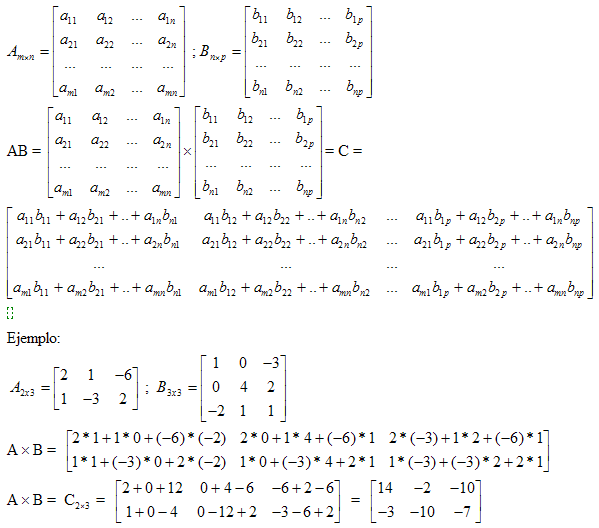

# Tema 6. Estructura de Datos. Listas

## Lista

La primera estructura de datos que veremos son las **listas**. Éstas son un conjunto de elementos ordenados separados por comas y escritos entre claudators, `[]`.

Las listas son:

* **hetereogéneas**: los elementos pueden ser de distinto tipo en una misma lista
* **mutables**: los elementos pueden ser modificados

Un ejemplo de lista sería

```python
l = ["Juan", 31, 172.32, True]
print(l)

#RESPUESTA
['Juan', 31, 172.32, True]
```

```python
type(l)

#RESPUESTA
list
```

### Tamaño de una lista

Para saber la longitud o el tamaño de una lista, podemos hacer uso de la función `len()`

```python
l = ["Zoe", "Pablo", "Miguel", "Silvia"]
len(l)

#RESPUESTA
4
```

### Elementos de una lista

Cada elemento en la lista tiene su propio índice

```python
names = ["Maria", "Juan", "Claudia", "Jorge", "Avelina"]
```

A `María` le corresponde el índice 0; a `Juan`, el 1; a `Claudia` el 2; a `Jorge`, el 3; y a `Avelina`, el 4.

**¡Cuidado!** En `Python`, los índices siempre empiezan en 0. De este modo, al primer elemento le corresponde el índice 0; al segundo, el índice 1; y al $n$-ésimo, le corresponde el índice $n−1$.

Dada una lista, podemos acceder a sus elementos utilizando la sintaxis `[]`.

```python
print(names[0])

#RESPUESTA
Maria
```

```python
print(names[3])

#RESPUESTA
Jorge
```

**¡Cuidado!** Si dada una lista llamamos a un elemento cuyo índice no existe para dicha lista, `Python` automáticamente nos devolverá error.

Podemos acceder a los últimos elementos de la lista haciendo uso de índices negativos.

```python
print(names[-1]) # Último elemento

#RESPUESTA
Avelina
```

```python
print(names[-3]) # Tercer elemento empezando por el final

#RESPUESTA
Claudia
```

Si en vez de querer acceder a los elementos uno por uno estamos interesados en acceder a avarios elementos a la vez, podemos hacer uso de la función `:`

```python
print(names[2:4])

#RESPUESTA
['Claudia', 'Jorge']
```

```python
print(names[:3])

#RESPUESTA
['Maria', 'Juan', 'Claudia']
```

```python
print(names[3:])

#RESPUESTA
['Jorge', 'Avelina']
```

**Observación.** En cuanto a la función `:`

* El índice indicado a la derecha de los `:` nunca es incluido
* Si no indicamos elemento a la izquierda de los `:`, por defecto `Python` interpreta que se trata del 0
* Si no indicamos elemento a la derecha, por defecto `Python`interpreta que debe mostrar los elemetos desde el índice indicado a la izquierda hasta el último.

Además de acceder, podemos modificar los elementos de una lista

```python
names[0] = "Marina"
names[3] = "Jaime"
names

#RESPUESTA
['Marina', 'Juan', 'Claudia', 'Jaime', 'Avelina']
```

Podemos añadir nuevos elementos a una lista con el método `.append()`

```python
names = ["María", "Cristina", "Juana"]
print(names)

names.append("Andrea")
print(names)
names.append("Ana")
print(names)
```

```
#RESPUESTA
['María', 'Cristina', 'Juana']
['María', 'Cristina', 'Juana', 'Andrea']
['María', 'Cristina', 'Juana', 'Andrea', 'Ana']
```

**Observación.** Los elementos añadidos con el método `.append()`, se incluyen al final.

Si quisiéramos añadir un nuevo elemento a una lista, pero no lo quisiéramos al final, sino en una posición específica, entonces utilizaremos el método `.insert()` al que primero le indicamos el índice donde queremos posicionar el nuevo elemento y, en segundo lugar, indicamos dicho nuevo elemento.

```python
names = ["Mario", "Cristian", "Juan"]
print(names)

names.insert(1, "Andrés")
print(names)
names.insert(3, "Miguel")
print(names)
```

```
#RESPUESTA
['Mario', 'Cristian', 'Juan']
['Mario', 'Andrés', 'Cristian', 'Juan']
['Mario', 'Andrés', 'Cristian', 'Miguel', 'Juan']
```

**Observación.** Cuando le indicamos que queremos el elemento `Andrés` en el índice 1, el que antes ocupaba dicho índice, `Cristian`, pasa a ocupar el siguiente, 2, y así con el resto de elementos que van a continuación.

#### EJERCICIO 1:&#x20;

Vamos a pedirle al usuario la longitud de una lista y haremos que introduzca por teclado tantos números enteros como haya indicado, que se guardarán en una lista. Al acabar, imprimiremos la lista.

```python
#Lo podemos hacer con un bucle while

print("+ Introduzca la longitud de una lista y despues la llenará con números enteros.")
lon = int(input("+ Introduzca la longitud de la lista: "))
l = []
while len(l) < lon:
    i = int(input("+ Introduzca un numero: "))
    l.append(i)
print(l)
```

```
#RESPUESTA
+ Introduzca la longitud de una lista y despues la llenará con números enteros.
+ Introduzca la longitud de la lista: 3
+ Introduzca un numero: 1
+ Introduzca un numero: 2
+ Introduzca un numero: 3
[1, 2, 3]
```

```python
#Podemos hacerlo tambien con bucle for

print("+ Introduzca la longitud de una lista y despues la llenará con números enteros.")
lon = int(input("+ Introduzca la longitud de la lista: "))
l = []
for c in range(lon):
    i = int(input("+ Introduzca un numero: "))
    l.append(i)
print(l)
```

```
#RESPUESTA
+ Introduzca la longitud de una lista y despues la llenará con números enteros.
+ Introduzca la longitud de la lista: 5
+ Introduzca un numero: 1
+ Introduzca un numero: 2
+ Introduzca un numero: 3
+ Introduzca un numero: 4
+ Introduzca un numero: 5
[1, 2, 3, 4, 5]
```

### Bucles con listas

Si quisiéramos imprimir por pantalla todos los elementos de una lista, lo podríamos hacer mediante los índices

```python
for i in range(len(names)):
  print(names[i])
```

```
#RESPUESTA
Mario
Andrés
Cristian
Miguel
Juan
```

o mucho más fácilmente iterando la lista con un `for` con la siguiente sintaxis:

```python
for name in names:
  print(name)
```

```
#RESPUESTA
Mario
Andrés
Cristian
Miguel
Juan
```

### Concatenación de listas

Dadas dos o más listas, podemos concatenarlas haciendo uso de la función `+`

```python
l1 = [True, 21, "Marta"]
l2 = [22.5, False, 22, "Rafa"]
print(l1 + l2)

#RESPUESTA
[True, 21, 'Marta', 22.5, False, 22, 'Rafa']
```

### Repetición de listas

Podemos repetir una misma lista tantas veces como queramos con la función `*`

```python
abc = ["A", "B", "C"]
print(abc * 5)

#RESPUESTA
['A', 'B', 'C', 'A', 'B', 'C', 'A', 'B', 'C', 'A', 'B', 'C', 'A', 'B', 'C']
```

### Lista vacía

```python
empty_list = []
print(len(empty_list))

#RESPUESTA
0
```

### Más métodos de listas

El método `.count()` recibe un elemento como argumento y cuenta la cantidad de veces que aparece en la lista

```python
numbers = [0, 1, 1, 2, 2, 2, 3, 3, 3, 3]

counted = []
for element in numbers:
  if element not in counted:
    counted.append(element)
    print("El elemento {} aparece {} veces".format(element, numbers.count(element)))
```

```
#RESPUESTA
El elemento 0 aparece 1 veces
El elemento 1 aparece 2 veces
El elemento 2 aparece 3 veces
El elemento 3 aparece 4 veces
```

El método `.extend()` extiende la lista agregando al final el iterable indicado por parámetro.

```python
numbers = [1, 2, 3, 4, 5]
print(numbers)
numbers.extend([6])
print(numbers)
numbers.extend([7, 8])
print(numbers)
numbers.extend(range(9, 16))
print(numbers)
```

```
#RESPUESTA
[1, 2, 3, 4, 5]
[1, 2, 3, 4, 5, 6]
[1, 2, 3, 4, 5, 6, 7, 8]
[1, 2, 3, 4, 5, 6, 7, 8, 9, 10, 11, 12, 13, 14, 15]
```

**Observación.** Un iterable es un objeto de `Python` capaz de devolver sus elementos uno por uno, permitiendo ser iterado en un bucle for. De momento solo conocemos las listas y el resultado de `range()`, pero en secciones futuras veremos los diccionarios, las tuplas y los conjuntos, que también son objetos iterables.

El método `index()` recibe un elemento como argumento y devuelve el índice de la primera aparición en la lista.

```python
numbers = [0, 1, 1, 2, 2, 2, 3, 4, 3, 4]
print(numbers.index(2))
print(numbers.index(4)) 
```

```
#RESPUESTA
3
7
```

El método `.pop()` devuelve el último elemento de la lista y lo borra de la misma.

```python
print(numbers)
for i in range(5):
    print(numbers.pop())
    print(numbers)
```

```
#RESPUESTA
[0, 1, 1, 2, 2, 2, 3, 4, 3, 4]
4
[0, 1, 1, 2, 2, 2, 3, 4, 3]
3
[0, 1, 1, 2, 2, 2, 3, 4]
4
[0, 1, 1, 2, 2, 2, 3]
3
[0, 1, 1, 2, 2, 2]
2
[0, 1, 1, 2, 2]
```

El método `.remove()` recibe como argumento un elemento y borra su primera aparición de la lista.

```python
numbers = [0, 1, 2, 4, 3, 4, 5, 6, 7]
numbers.remove(4)
print(numbers)

#RESPUESTA
[0, 1, 2, 3, 4, 5, 6, 7]
```

El método `.reverse()` devuelve la lista en orden inverso.

```python
numbers = [1, -1, 2, -2, 3, -3]
numbers.reverse()
print(numbers)

#RESPUESTA
[-3, 3, -2, 2, -1, 1]
```

El método `.sort()` devuelve la lista en orden.

```python
numbers = [1, 3, 5, 2, 4]
numbers.sort()
print(numbers)

#RESPUESTA
[1, 2, 3, 4, 5]
```

Si quisiésemos ordenar los elementos en orden decreciente, podríamos hacer uso del parámetro `reverse` del método `.sort()`:

```python
numbers = [1, 3, 5, 2, 4]
numbers.sort(reverse = True)
print(numbers)

#RESPUESTA
[5, 4, 3, 2, 1]
```

**Observación.** De momento solo conocemos las listas y el resultado de `range()`, pero en secciones futuras veremos los diccionarios, las tuplas y los conjuntos, que también son objetos iterables.

#### EJERCICIO 2:&#x20;

Dada una lista de caracteres, le pediremos al usuario qué elemento quiere eliminar y lo eliminaremos de la lista.

```python
print("+ De la siguiente lista, indique el indice del elemento que desea eliminar:")
l = ["m", 3, 54, "mike", 4.5, 3]
print("+ ", l, "\n")

n = int(input("+ Introduzca el indice del elemento que desea eliminar (recuerde que empiezan por 0): "))
print("\n+ ¿Seguro que desea eliminar el elemento \"{}\"?".format(l[n]))
conf = input("\n+ S/N: ")

if conf == "S":
    l.remove(l[n])
    print("+ ", l)
else:
    print("\n- Vuelva a intentarlo.")
```

```
#RESPUESTA
+ De la siguiente lista, indique el indice del elemento que desea eliminar:
+  ['m', 3, 54, 'mike', 4.5, 3] 

+ Introduzca el indice del elemento que desea eliminar (recuerde que empiezan por 0): 0

+ ¿Seguro que desea eliminar el elemento "m"?

+ S/N: N

- Vuelva a intentarlo.
```

#### EJERCICIO 3:&#x20;

Vamos a pedir al usuario que ingrese 10 números, los guardaremos en una lista y mostraremos la lista ordenada, siendo el usuario quien indique el orden: ascendente o descendente.

```python
l = []
print("+ A continuación ingresará 10 números y la aplicación se los mostrará ordenados.")
orden = input("+ ¿Quiere la lista en orden ascendente? Introduzca S. En caso contrario el orden será descendente. ")

if orden != "S":
    desc = True
else:
    desc = False

for n in range(10):
    m = int(input("Introduzca un número:"))
    l.append(m)

l.sort(reverse=desc)

print("La lista ordenada es: ")
print(l)
```

```
#RESPUESTA
+ A continuación ingresará 10 números y la aplicación se los mostrará ordenados.
+ ¿Quiere la lista en orden ascendente? Introduzca S. En caso contrario el orden será descendente. 
Introduzca un número:2
Introduzca un número:5
Introduzca un número:6
Introduzca un número:9
Introduzca un número:8
Introduzca un número:555
Introduzca un número:1
Introduzca un número:23
Introduzca un número:6
Introduzca un número:54
La lista ordenada es: 
[555, 54, 23, 9, 8, 6, 6, 5, 2, 1]
```

### Conversión a listas

Para convertir un objeto iterable de `Python` a lista, hay que usar la función `list()`

```python
print(range(0, 100, 10))

#RESPUESTA
range(0, 100, 10)
```

```python
print(type(range(0, 100, 10)))

#RESPUESTA
<class 'range'>
```

```python
print(list(range(0, 100, 10)))

#RESPUESTA
[0, 10, 20, 30, 40, 50, 60, 70, 80, 90]
```

```python
print(type(list(range(0, 100, 10))))

#RESPUESTA
<class 'list'>
```

#### EJERCICIO 4:&#x20;

Vamos a convertir los números impares del 0 al 30 a una lista y mostrar los elementos con el fomato "El valor {} ocupa el índice {}"

```python
l = list(range(1, 30, 2))

for n in range(len(l)):
    print("El valor {} ocupa el índice {}".format(l[n], n))
```

```
#RESPUESTA
El valor 1 ocupa el índice 0
El valor 3 ocupa el índice 1
El valor 5 ocupa el índice 2
El valor 7 ocupa el índice 3
El valor 9 ocupa el índice 4
El valor 11 ocupa el índice 5
El valor 13 ocupa el índice 6
El valor 15 ocupa el índice 7
El valor 17 ocupa el índice 8
El valor 19 ocupa el índice 9
El valor 21 ocupa el índice 10
El valor 23 ocupa el índice 11
El valor 25 ocupa el índice 12
El valor 27 ocupa el índice 13
El valor 29 ocupa el índice 14
```

### Listas anidadas

Las listas anidadas son listas dentro de listas. Es decir, las listas no solo pueden contener números, strings o datos booleanos, sino que también pueden contener otras listas.

#### **Ejemplo 1**

A continuación mostramos una lista anidada, pues consta de 3 elementos:

* 1 lista de 3 strings
* 1 lista heterogénea de 3 elementos que a su vez contiene una lista con 5 números
* 1 número

```python
l = [["María", "Santos", "Fernández"],
     ["Juan", [1, 2, 3, 4, 5], 32], 
     2]
print(l)

#RESPUESTA
[['María', 'Santos', 'Fernández'], ['Juan', [1, 2, 3, 4, 5], 32], 2]
```

_Para que se vea más claro se puede colocar cada elemento de la lista en una nueva linea para que sea más facil de visualizar._

Para acceder a un elemento, necesitamos indicar su índice. Si un elemento está en una lista dentro de una lista dentro de una lista, en primer lugar indicamos el índice de la lista exterior dentro de `[]`; después, el índice de la siguiente lista más exterior también entre `[]`; y por último, el índice de la lista más interna, claramente también entre `[]`.

Accedamos al string `Fernández`y luego al número `5`.

```python
print(l[0][2]) # Fernández
print(l[1][1][4]) # 5
```

```
#RESPUESTA
Fernández
5
```

***

## Matrices

Hay un tipo muy utilizado de listas anidadas. Se caracteriza por ser una lista de $m$ listas, donde cada una de las listas tiene el mismo número de elementos, $n$. A este tipo de listas se les conoce como matrices.

```python
matrix = [[1, 2, 3], [4, 5, 6], [7, 8, 9]]
```

En matemáticas, las matrices se definen del siguiente modo.

**Matriz.** Una matriz de dimensiones **m x n** es una tabla formada por elementos dispuestos en **m** filas y **n** columnas de la forma:

 (1).png>)

Los elementos de la matriz se representan con doble subíndice, donde el primero indica la fila a la que pertenece y, el segundo, la columna.

Para acceder a los elementos de una matriz en `Python`, utilizamos la sintaxis `[][]`, donde primero indicamos la fila y, a continuación, la columna

```python
matrix[0][2]

#RESPUESTA
3
```

```python
matrix[1][1]

#RESPUESTA
5
```

```python
matrix[2][0]

#RESPUESTA
7
```

Podemos mostrar una matriz de `Python` en forma de tabla con un bucle `for`, del siguiente modo

```python
for row in matrix: # Accedemos a las filas de la matrix
  print(row)
```

```
#RESPUESTA
[1, 2, 3]
[4, 5, 6]
[7, 8, 9]
```

Si lo que queremos es mostrar todos los elementos de la matriz en columna, podemos utilizar dos bucles `for` anidados del siguiente modo:

```python
for row in matrix: # Accedemos a las filas
  for element in row: # Accedemos a los elementos de las filas
    print(element)
```

```
#RESPUESTA
1
2
3
4
5
6
7
8
9
```

Si lo que queremos es mostrar la matriz en forma de tabla, sin comas ni claudators por en medio, lo podemos hacer de dos formas:

* Haciendo uso de las dimensiones de la matriz y, por tanto, de la función `range()`
* Sin hacer uso de las dimensiones

La primera forma sería:

```python
# m es el número de filas y n, el de columnas
m = len(matrix)
n = len(matrix[0])

for i in range(m):
  for j in range(n):
    print(matrix[i][j], end = " ")
  print("")
```

```
#RESPUESTA
1 2 3 
4 5 6 
7 8 9 
```

**Observación.**

1. Como todas las filas tienen el mismo número de elementos, nos da igual si calculamos $n$ con la primera fila o con cualquier otra.
2. Hemos hecho uso del parámetro `end` de la función `print()` para indicar si, en vez de un salto de línea como ocurre por defecto, queremos que suceda otra cosa inmediatamente después de ejecutar la función `print()`. En este caso, hemos indicado que queremos un espacio en blanco.

Y la segunda forma, es la siguiente:

```python
for row in matrix:
  for element in row:
    print(element, end = " ")
  print("")
```

```
#RESPUESTA
1 2 3 
4 5 6 
7 8 9 
```

### **Suma de matrices**

Para poder sumar dos matrices, necesitamos que tengan la misma dimensión. Entonces, dadas **A** y **B** dos matrices con dimensión **m x n** , su suma será una matriz de dimensión **m x n** y sus elementos se obtienen del siguiente modo:

 (1).png>)

Dadas dos matrices con la misma dimensión, las podemos usar haciendo uso de bucles `for` anidados.

```python
A = [[1, 0, -3], [2, 0, 1], [-1, -1, 0]]
B = [[-1, -2, 0], [-2, 3, 0], [0, 0, -3]]

m = len(A)
n = len(A[0])

if len(A) == len(B) and len(A[0]) == len(B[0]):
  C = []

  for i in range(m):
    C.append([])
    for j in range(n):
      C[i].append(A[i][j] + B[i][j])

  print(C)

else:
  print("No se puede realizar la suma, pues las dimensiones de las matrices no coinciden.")
  
#RESPUESTA
[[0, -2, -3], [0, 3, 1], [-1, -1, -3]]
```


```python
for row in C:
  print(row)
```

```
[0, -2, -3]
[0, 3, 1]
[-1, -1, -3]
```

**Observación.** Hemos puesto un `if` que, suponiendo que tanto **A** como **B** son matrices, comprueba si sus dimensiones coinciden. De ser cierto, procede a hacer la suma. De lo contrario, devuelve un mensaje indicando que la suma no puede llevarse a cabo.

### **Producto de matrices**

Para poder multiplicar matrices, necesitamos que la matriz de la izquierda tenga el mismo número de columnas que número de filas tiene la matriz de la derecha. Entonces, dadas las matrices **A** y **B** de dimensiones **m x n** y **n x p** respectivamente, su producto será una matriz de dimensión **m x p** y se obtiene del siguiente modo:



Dadas dos matrices, la primera con el mismo número de columnas que filas tiene la segunda, podemos multiplicarlas del siguiente modo:

```python
A = [[1, 0, -3, 2], [2, 0, 1, 1], [-1, 0, -1, 0]]
B = [[-1, -2, 0], [-2, 3, 0], [0, 0, -3], [1, 1, -1]]

m, n, p = len(A), len(B), len(B[0])

C = []

for i in range(m):
  C.append([])
  for j in range(p):
    elemento = 0
    for k in range(n):
      elemento = elemento + A[i][k] * B[k][j]
    C[i].append(elemento)
```

El resultado de multiplicar las matrices **A** y **B** ha sido:

```python
for row in C:
  print(row)
```

```
#RESPUESTA
[1, 0, 7]
[-1, -3, -4]
[1, 2, 3]
```

#### EJERCICIO 5:&#x20;

Vamos a crear manualmente una matriz de tamaño 4 x 4 y guardarla en una lista.

```python
A = []

for i in range(4):
    A.append([])
    for j in range(4):
        A[i].append(float(input("introduce el elemento {},{}: ".format(i,j))))

for i in range(4):
  for j in range(4):
    print(A[i][j], end = "  " if A[i][j] >= 0 else " ")
  print("")
```

```
#RESPUESTA
introduce el elemento 0,0: 1
introduce el elemento 0,1: 5
introduce el elemento 0,2: -3.5
introduce el elemento 0,3: 3.2
introduce el elemento 1,0: 5.6
introduce el elemento 1,1: 1.2
introduce el elemento 1,2: 10.5
introduce el elemento 1,3: 10.2
introduce el elemento 2,0: 52.3
introduce el elemento 2,1: -6265
introduce el elemento 2,2: -658
introduce el elemento 2,3: 3.254
introduce el elemento 3,0: 6768
introduce el elemento 3,1: 2549
introduce el elemento 3,2: 655498
introduce el elemento 3,3: 215
1.0  5.0  -3.5 3.2  
5.6  1.2  10.5  10.2  
52.3  -6265.0 -658.0 3.254  
6768.0  2549.0  655498.0  215.0  
```

#### EJERCICIO 6:&#x20;

Vamos a sumar dos matrices con listas. Ambas matrices serán proporcionadas por el usuario, así como la dimensión de las matrices.

```python
n = int(input("Número de filas de las matrices: "))
m = int(input("Número de columnas de las matrices: "))

A = []
print("\n=== Matriz A ===")
for i in range(n):
  A.append([])
  for j in range(m):
    A[i].append(float(input("Introduce el elemento ({},{}) ".format(i, j))))

B = []
print("\n=== Matriz B ===")
for i in range(n):
  B.append([])
  for j in range(m):
    B[i].append(float(input("Introduce el elemento ({},{}) ".format(i, j))))

C = []
for i in range(n):
  C.append([])
  for j in range(m):
    C[i].append(A[i][j] + B[i][j])

print("\n=== Matriz A + B ===")
for i in range(n):
  for j in range(m):
    print(C[i][j], end = "  " if C[i][j] >= 0 else " ")
  print("")
```

#### EJERCICIO 7:&#x20;

Vamos a calcular el producto de dos matrices con listas. Ambas matrices serán dadas por el usuario así como las dimensiones de ambas.

```python
n = int(input("Número de filas de la matriz A: "))
m = int(input("Número de columnas de la matriz A: "))
p = int(input("Número de columnas de la matriz B: "))

A = []
print("\n=== Matriz A ===")
for i in range(n):
  A.append([])
  for j in range(m):
    A[i].append(float(input("Introduce el elemento ({},{}) ".format(i,j))))

B = []
print("\n=== Matriz B ===")
for i in range(m):
  B.append([])
  for j in range(p):
    B[i].append(float(input("Introduce el elemento ({},{}) ".format(i,j))))

C = []
for i in range(n):
  C.append([])
  for j in range(p):
    elemento = 0
    for k in range(m):
      elemento += A[i][k] * B[k][j]
    C[i].append(elemento)

print("\n=== Matriz A · B ===")
for i in range(n):
  for j in range(p):
    print(C[i][j], end = "  " if C[i][j] >= 0 else " ")
  print("")
```

### **Matrices con `numpy`**

Existe una forma más sencilla de trabajar con matrices y es gracias a la librería `numpy`. Para importarla, simplemente hay que ejecutar la siguiente línea de código.

```python
import numpy as np
```

Para crear una matriz vacía, usamos el método `.empty()`, al que le indicamos por parámetro las dimensiones

```python
A = np.empty((2, 3)) # 2 filas y 3 columnas
print(A)
```

```
#RESPUESTA
[[4.67006204e-310 0.00000000e+000 0.00000000e+000]
 [0.00000000e+000 0.00000000e+000 0.00000000e+000]]
```

Para crear una matriz vacía con las mismas dimensiones de otra matriz definida anteriormente, usamos el método `.empty_like()`, al que le indicamos por parámetro la matriz existente

```python
B = np.empty_like(A) # Tendrá 2 filas y 3 columnas
print(B)
```

```
#RESPUESTA
[[4.67006204e-310 0.00000000e+000 0.00000000e+000]
 [0.00000000e+000 0.00000000e+000 0.00000000e+000]]
```

Para crear una matriz nula, usamos el método `.zeros()`, al que le indicamos por parámetro las dimensiones

```python
C = np.zeros((3, 5)) # Matriz nula de dimensiones 3 x 5
print(C)
```

```
#RESPUESTA
[[0. 0. 0. 0. 0.]
 [0. 0. 0. 0. 0.]
 [0. 0. 0. 0. 0.]]
```

Para crear una matriz de ceros con las mismas dimensiones de otra matriz definida anteriormente, usamos el método `.zeros_like()`, al que le indicamos por parámetro la matriz existente

```python
D = np.zeros_like(A) # Tendrá 2 filas y 3 columnas y todos sus elementos valdrán 0
print(D)
```

```
#RESPUESTA
[[0. 0. 0.]
 [0. 0. 0.]]
```

Para crear una matriz de unos, usamos el método `.ones()`, al que le indicamos por parámetro las dimensiones

```python
E = np.ones((1, 4)) # Matriz de unos de dimensiones 1 x 4
print(E)

#RESPUESTA
[[1. 1. 1. 1.]]
```

Para crear una matriz de unos con las mismas dimensiones de otra matriz definida anteriormente, usamos el método `.ones_like()`, al que le indicamos por parámetro la matriz existente

```python
F = np.ones_like(C) # Tendrá 3 filas y 5 columnas y todos sus elementos valdrán 1
print(F)
```

```
#RESPUESTA
[[1. 1. 1. 1. 1.]
 [1. 1. 1. 1. 1.]
 [1. 1. 1. 1. 1.]]
```

Podemos crear matrices de numpy a partir de listas con el método `.matrix()`

```python
M = np.matrix([[1, 0, -3, 2], [2, 0, 1, 1], [-1, 0, -1, 0]])
print(M)
```

```
#RESPUESTA
[[ 1  0 -3  2]
 [ 2  0  1  1]
 [-1  0 -1  0]]
```

Para saber las dimensiones de una matriz, podemos utilizar el método `.shape`

```python
M.shape

#RESPUESTA
(3, 4)
```

Ahora es más sencillo sumar matrices, pues solamente necesitamos la función `+`

```python
A = np.matrix([[1, 0, -3], [2, 0, 1], [-1, -1, 0]])
B = np.matrix([[-1, -2, 0], [-2, 3, 0], [0, 0, -3]])
matrixSum = A + B
matrixSum
```

```
#RESPUESTA
matrix([[ 0, -2, -3],
        [ 0,  3,  1],
        [-1, -1, -3]])
```

También es más sencillo hacer el producto matricial $A\cdot B$ con el método `.dot()`

```python
A = np.matrix([[1, 0, -3, 2], [2, 0, 1, 1], [-1, 0, -1, 0]])
B = np.matrix([[-1, -2, 0], [-2, 3, 0], [0, 0, -3], [1, 1, -1]])

matrixProd = A.dot(B)
matrixProd
```

```
#RESPUESTA
matrix([[ 1,  0,  7],
        [-1, -3, -4],
        [ 1,  2,  3]])
```

Gracias a `numpy`, también es mucho más sencillo mostrar una matriz en forma de tabla, pues nos basta con hacer uso de la función `print()`:

```python
print(matrixSum)
print(matrixProd)
```

```
#RESPUESTA
[[ 0 -2 -3]
 [ 0  3  1]
 [-1 -1 -3]]
[[ 1  0  7]
 [-1 -3 -4]
 [ 1  2  3]]
```

En futuras secciones hablaremos más detenidamente de todo lo que es capaz la librería `numpy`.

#### EJERCICIO 8:&#x20;

Vamos a introducir manualmente una matriz con numpy donde las dimensiones son proporcionadas por el usuario.

```python
import numpy as np
n = int(input("Número de filas: "))
m = int(input("Número de columnas: ")) 

A = np.empty((n, m))

for i in range(n):
  for j in range(m):
    A[i, j] = float(input("Introduce el elemento ({},{}) ".format(i, j)))

print("\n=== Matriz A ===")
print(A)
```

```
#RESPUESTA
Número de filas: 3
Número de columnas: 2
Introduce el elemento (0,0) 1
Introduce el elemento (0,1) 0
Introduce el elemento (1,0) 0
Introduce el elemento (1,1) 2
Introduce el elemento (2,0) 1
Introduce el elemento (2,1) -1

=== Matriz A ===
[[ 1.  0.]
 [ 0.  2.]
 [ 1. -1.]]
```

#### EJERCICIO 9:&#x20;

Vamos a sumar dos matrices con numpy. Ambas matrices las proporcionará el usuario, así como sus dimensiones.

```python
import numpy as np
n = int(input("Número de filas: "))
m = int(input("Número de columnas: "))

A = np.empty((n, m))
print("\n=== Matriz A ===")
for i in range(n):
  for j in range(m):
    A[i, j] = float(input("Introduce el elemento ({},{}) ".format(i, j)))

B = np.empty((n, m))
print("\n=== Matriz B ===")
for i in range(n):
  for j in range(m):
    B[i, j] = float(input("Introduce el elemento ({},{}) ".format(i, j)))

print("\n=== Matriz A + B ===")
print(A + B)
```

#### EJERCICIO 10:&#x20;

Vamos a multiplicar dos matrices con numpy. Ambas matrices serán proporcionadas por el usuario, así como la dimensión de ambas.

```python
import numpy as np
n = int(input("Número de filas de A: "))
m = int(input("Número de columnas de A: "))
p = int(input("Número de columnas de B: "))

A = np.empty((n, m))
print("\n=== Matriz A ===")
for i in range(n):
  for j in range(m):
    A[i, j] = float(input("Introduce el elemento ({},{}) ".format(i, j)))

B = np.empty((m, p))
print("\n=== Matriz B ===")
for i in range(m):
  for j in range(p):
    B[i, j] = float(input("Introduce el elemento ({},{}) ".format(i, j)))

print("\n=== Matriz A · B ===")
print(A.dot(B))
```

```
#RESPUESTA
Número de filas de A: 3
Número de columnas de A: 2
Número de columnas de B: 3

=== Matriz A ===
Introduce el elemento (0,0) 1
Introduce el elemento (0,1) 0
Introduce el elemento (1,0) 0
Introduce el elemento (1,1) 1
Introduce el elemento (2,0) 0
Introduce el elemento (2,1) 1

=== Matriz B ===
Introduce el elemento (0,0) 3
Introduce el elemento (0,1) 2
Introduce el elemento (0,2) 0
Introduce el elemento (1,0) 1
Introduce el elemento (1,1) 1
Introduce el elemento (1,2) -1

=== Matriz A · B ===
[[ 3.  2.  0.]
 [ 1.  1. -1.]
 [ 1.  1. -1.]]
```

## REPASO

```python
#EJERCICIO 1: Crea un programa que lea una secuencia de caracteres, guarde cada caracter en una posición de una lista y
#finalmente muestre la secuencia invertida.

l = []
n = 0
while n != "":
    n = input("+ Introduzca un elemento para la lista (Pulse enter para terminar): ")
    l.append(n)
    
l.pop()
l.reverse()3
print("\n=== Lista terminada ===\n", l)
```

```
#RESPUESTA
+ Introduzca un elemento para la lista (Pulse enter para terminar): 1
+ Introduzca un elemento para la lista (Pulse enter para terminar): 2
+ Introduzca un elemento para la lista (Pulse enter para terminar): 

=== Lista terminada ===
 ['2', '1']
```

```python
#EJERCICIO 2: Crea un programa que lea dos strings de la misma longitud, los guarde intercalados en una lista. Por último, mostrar el contenido de la lista.
# Por ejemplo, si introducimos hola caracola y adios marieta, debería mostrarse haodleao sc amraarcioeltaa.

s1 = input("+ Introduzca el primer string: ")
s2 = input("+ Introduzca el segundo string: ")

l = []
if len(s1) == len(s2):
    for n in range(len(s1)):
        l.append(s1[n])
        l.append(s2[n])
else:
    print("Los string tienen que tener la misma longitud.")
for m in range(len(l)):
    print(l[m], end = "")
```

```
#RESPUESTA
+ Introduzca el primer string: ola ke ase
+ Introduzca el segundo string: uuuuuuuuuu
ouluau ukueu uausueu
```

```python
#EJERCICIO 3: Crea un programa que lea un string y guarde en una lista todas las consonantes.

s = input("+ Introduzca un string: ")
s = s.lower()
l = []

for n in range(len(s)):
    if s[n] != "a" and s[n] != "e" and s[n] != "i" and s[n] != "o" and s[n] != "u" and s[n] != " ":
        l.append(s[n])
print(l)
```

```
#RESPUESTA
Introduzca un string: ola ke ase
['l', 'k', 's']
```

```python
#EJERCICIO 4: Crea un programa que lea una palabra, la guarde en una lista y compruebe si se trata de un palíndromo.

s = input("+ Introduzca una palabra: ")
s = s.lower()

if s.find(" ") == -1:
    l = []
    for n in range(len(s)):
        l.append(s[n])
    L = l
    L.reverse()
    if l == L:
        print("\n+ La palabra {} es un palindromo.".format(s))
    else:
        print("\n+ La palabra {} NO es un palindromo.".format(s))
else:
    print("\n- Le recomendamos que lo vuelva a intentar sin espacios.")
```

```
#RESPUESTA
+ Introduzca una palabra: anilina

+ La palabra anilina es un palindromo.
```

```python
#EJERCICIO 5: Crea un programa que lea una matriz 3 x 3 y devuelva el máximo de cada fila.

A = []
for i in range(3):
    A.append([])
    for j in range(3):
        A[i].append(float(input("+ Introduzca el valor para ({},{}): ".format(i, j))))

for n in range(3):
    if A[n][0] > A[n][1] and A[n][0] > A[n][2]:
        print(A[n][0])
    if A[n][1] > A[n][0] and A[n][1] > A[n][2]:
        print(A[n][1])
    else:
        print(A[n][2])
```

```
#RESPUESTA
Introduzca el valor para (0,0): 1
Introduzca el valor para (0,1): 2
Introduzca el valor para (0,2): 3
Introduzca el valor para (1,0): 4
Introduzca el valor para (1,1): 5
Introduzca el valor para (1,2): 6
Introduzca el valor para (2,0): 7
Introduzca el valor para (2,1): 8
Introduzca el valor para (2,2): 9
3.0
6.0
9.0
```

```python
#EJERCICIO 6: Crea un programa que lea un entero, n, de teclado y construya una matriz de tamaño n × n. Cada posición debe contener su orden en la matriz 
#(desde 0 hasta n^2 − 1). Por ejemplo, si n es 3, deberá crearse la matriz:
#[0, 1, 2]
#[3, 4, 5]
#[6, 7, 8]

import numpy as np

n = int(input("+ Introduzca un valor entero: "))

A = np.empty((n,n))
t = 0
for j in range(n):
    for k in range(n):
        A[j][k] = t
        t += 1
print(A)
```

```
#RESPUESTA
Introduzca un valor entero: 3
[[0. 1. 2.]
 [3. 4. 5.]
 [6. 7. 8.]]
```

```python
#EJERCICIO 7: Crea una matriz de n × m y asigna los valores manualmente. El programa debe indicar si la suma de cada columna es el mismo valor.

import numpy as np

n = int(input("+ Introduzca un valor entero. Será la cantidad de filas de la matriz: "))
m = int(input("+ Introduzca un valor entero. Será la cantidad de columnas de la matriz: "))
A = np.empty((n,m))

for i in range(n):
    for j in range(m):
        A[i][j] = float(input("Introduce el valor para el elemento ({},{})".format(i, j)))
print(A)
l = []
for o in range(n):
    elemento = 0
    for p in range(m):
        elemento = elemento + A[o][p]
    l.append(elemento)
for q in range (n):
    if l[0] != l[n - 1]:
        print("La suma de las columnas no es igual.")
        break
    else:
        iguales = True
if iguales == True:
    print("La suma de las columnas es igual")
```

```
#RESPUESTA
+ Introduzca un valor entero. Será la cantidad de filas de la matriz: 2
+ Introduzca un valor entero. Será la cantidad de columnas de la matriz: 2
Introduce el valor para el elemento (0,0)1
Introduce el valor para el elemento (0,1)1
Introduce el valor para el elemento (1,0)1
Introduce el valor para el elemento (1,1)1
[[1. 1.]
 [1. 1.]]
La suma de las columnas es igual
```

```python
#EJERCICIO 8: Crear un programa determina si la matriz introducida manualmente (tanto sus dimensiones como los elementos) se trata de la matriz identidad. 
#Recuerda que la matriz identidad debe ser una matriz cuadrada.

import numpy as np

n = int(input("+ Introduzca un valor entero. Será la cantidad de filas de la matriz: "))
m = int(input("+ Introduzca un valor entero. Será la cantidad de columnas de la matriz: "))
A = np.empty((n,m))

for i in range(n):
    for j in range(m):
        A[i][j] = float(input("Introduzca el valor del elemento ({},{}): ".format(i, j)))

if n == m:
    for k in range (n):
        for l in range(m):
            if k == l and A[k][l] == 1:
                identidad = True
            elif k != l and A[k][l] == 0:
                identidad = True
            else:
                print("La matriz no es Identidad.")
                break
    if identidad == True:
        print("La matriz es identidad.\n\n")
        print(A)
else:
    print("La matriz no es Identidad.")
```

```
#RESPUESTA
+ Introduzca un valor entero. Será la cantidad de filas de la matriz: 3
+ Introduzca un valor entero. Será la cantidad de columnas de la matriz: 3
Introduzca el valor del elemento (0,0): 1
Introduzca el valor del elemento (0,1): 0
Introduzca el valor del elemento (0,2): 0
Introduzca el valor del elemento (1,0): 0
Introduzca el valor del elemento (1,1): 1
Introduzca el valor del elemento (1,2): 0
Introduzca el valor del elemento (2,0): 0
Introduzca el valor del elemento (2,1): 0
Introduzca el valor del elemento (2,2): 1
La matriz es identidad.


[[1. 0. 0.]
 [0. 1. 0.]
 [0. 0. 1.]]
```

```python
#EJERCICIO 9: Realiza un programa que calcule la matriz transpuesta.

import numpy as np

n = int(input("+ Introduzca un valor entero. Será la cantidad de filas de la matriz: "))
m = int(input("+ Introduzca un valor entero. Será la cantidad de columnas de la matriz: "))
A = np.empty((n,m))

for i in range(n):
    for j in range(m):
        A[i][j] = float(input("Introduzca el valor del elemento ({},{}): ".format(i, j)))

print("\n===MATRIZ===")
print(A)
print("\n===MATRIZ TRASPUESTA===")
print(np.transpose(A))
```

```
#RESPUESTA
+ Introduzca un valor entero. Será la cantidad de filas de la matriz: 3
+ Introduzca un valor entero. Será la cantidad de columnas de la matriz: 2
Introduzca el valor del elemento (0,0): 1
Introduzca el valor del elemento (0,1): 2
Introduzca el valor del elemento (1,0): 3
Introduzca el valor del elemento (1,1): 1
Introduzca el valor del elemento (2,0): 2
Introduzca el valor del elemento (2,1): 3

===MATRIZ===
[[1. 2.]
 [3. 1.]
 [2. 3.]]

===MATRIZ TRASPUESTA===
[[1. 3. 2.]
 [2. 1. 3.]]
```

```python
#EJERCICIO 10: Crea un programa que pida al usuario la dimensión y cree la matriz identidad de orden correspondiente con numpy.
import numpy as np

n = int(input("Introduzca la dimensión de la matriz identidad: "))

print(np.identity(n))
```

```
#RESPUESTA
Introduzca la dimensión de la matriz identidad: 6
[[1. 0. 0. 0. 0. 0.]
 [0. 1. 0. 0. 0. 0.]
 [0. 0. 1. 0. 0. 0.]
 [0. 0. 0. 1. 0. 0.]
 [0. 0. 0. 0. 1. 0.]
 [0. 0. 0. 0. 0. 1.]]
```
